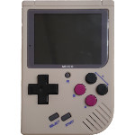

# Miyoo(Bittboy)

  
## Introduction
You might ask why do you need to port Linux OS into Miyoo(Bittboy) handheld because stock firmware seems running pretty well ? Since stock firmware is Melis OS that is close-source for Allwinner SoC, the performance is not good as I expected (not you) and it is not easy to port game and emulator to this OS because we cannot get more information from google unless reversing (it is not easy as you think). Of course, it also lacks toolchain to port app and emulator. So, if I can port Linux OS into this tiny device, I think it will be more powerful. Besides, we can also port more games and emulators into this device if it is Linux OS. Now, I finish most of tasks and it is time to share to all of you, enjoy !  
  
|Component|Description                         |
|---------|------------------------------------|
|CPU      |Allwinner F1C500S                   |
|RAM      |32MB                                |
|Screen   |2.4" IPS 320x240(LH240Q36)          |
|Slot     |MicroSD                             |
|Gamepad  |DPad, 4 Buttons, Start, Select, Menu|
|USB      |Client                              |
|Battery  |3.7V 600mA                          |
|Dimension|68mm x 100mm x 15mm                 |
|Weight   |80g                                 |
  
## How to build Linux OS for Miyoo(Bittboy)  
### prepare environment
-  Debian 9 (x64)
-  download all of sources in release page
  
### configure toolchain
-  extract toolchain.7z into /opt/miyoo
-  export command
   -  export PATH=$PATH:/opt/miyoo/bin
  
### build uboot
-  boot from SPI flash
   -  make ARCH=arm CROSS_COMPILE=arm-linux-gnueabi- licheepi_nano_spiflash_defconfig && make ARCH=arm
-  boot from SDCard
   -  make ARCH=arm CROSS_COMPILE=arm-linux-gnueabi- licheepi_nano_defconfig && make ARCH=arm
  
### build kernel (sdcard 4bits)
-  vim arch/arm/boot/dts/suniv-f1c500s-miyoo.dts +55
   -  bus-width = <4>;
-  make ARCH=arm CROSS_COMPILE=arm-linux-gnueabi- miyoo_defconfig && make ARCH=arm zImage
  
### build kernel (sdcard 1bit)
-  vim arch/arm/boot/dts/suniv-f1c500s-miyoo.dts +55
   -  bus-width = <1>;
-  make ARCH=arm CROSS_COMPILE=arm-linux-gnueabi- miyoo_defconfig && make ARCH=arm zImage
  
### build boot.scr
-  mkimage -C none -A arm -T script -d boot.cmd boot.scr
  
### prepare SDCard (>= 4GB)
-  partition 1: 256MB FAT32 (boot.scr, dtb and zImage)
-  partition 2: 256MB EXT4 (rootfs)
-  partition 3: 256MB SWAP
-  partition 4: FAT32 (GMenu2X, config files and emulators)
  
### flash uboot:
-  boot from SPI Flash
   -  short SPI Pin1 and Pin2
   -  connect USB to PC
   -  found device: 
      -  usb 4-1.2.4.4: New USB device found, idVendor=1f3a, idProduct=efe8
   -  release SPI Pin1 and Pin2
   -  flash command: 
      -  $ sudo sunxi-fel -p spiflash-write 0 u-boot-sunxi-with-spl.bin
-  boot from SDCard
   -  $ sudo dd if=u-boot-sunxi-with-spl.bin of=/dev/sdX bs=1024 seek=8
  
### flash kernel
-  copy boot.scr into Partition 1
-  copy zImage into Partition 1
-  copy suniv-f1c500s-miyoo.dtb into Partition 1
-  copy r61520fb.ko into kernel folder in Partition 2
-  copy daemon into kernel folder in Partition 2
  
### build rootfs
-  download buildroot-2018.02.9 from https://buildroot.org
-  use config_buildroot-2018.02.9 and then make it
-  toolchain location: /opt/miyoo
-  rootfs location: output/images/rootfs.tar
  
### flash rootfs
-  extract rootfs.tar into Partition 2

### https://steward-fu.github.io/website/index.htm
